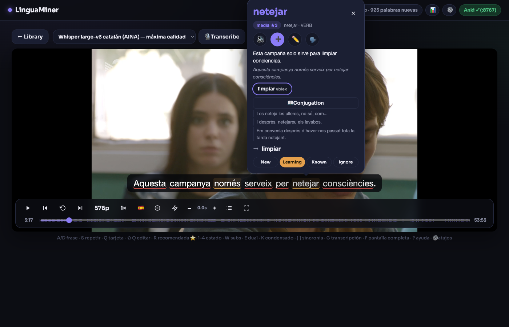
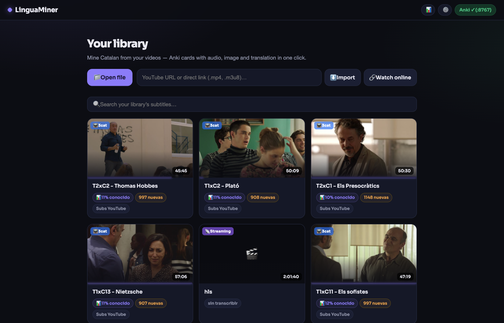
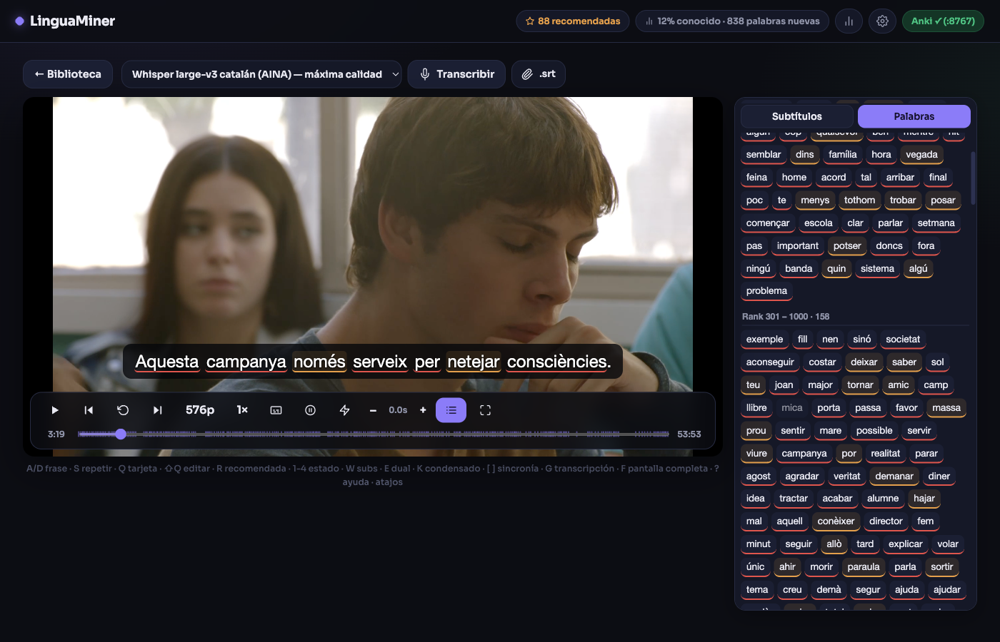

# ⛏️ LinguaMiner

[](https://github.com/thecopybookhare-cmd/lingua-miner/actions)


**Local, Migaku-style flashcard miner — learn languages from the videos you love.**

Watch anything with word-by-word interactive subtitles, click a word, and get an
Anki card with the audio of the sentence, a video frame, the sentence + neural
translation, and the word's lemma, part of speech, dictionary senses and
frequency. Everything runs **100% locally** — no accounts, no paid APIs.



## Features

- 🎙️ **Transcription** with Whisper (fine-tuned Catalan model, or generic
  large-v3 / small) — or use the video's own `.srt` / YouTube subtitles.
- 🖱️ **One-click mining**: click any subtitle word (or drag to select an
  expression) → editable Anki card with segment audio (ffmpeg-trimmed), video
  frame, sentence + translation.
- 🌍 **Multi-language**: study Catalan, French, English, German or
  **European Portuguese**. Neural OPUS-MT translation (CTranslate2, offline)
  into **Spanish or English** — pick the base under ⚙️ *Settings → Translate
  to*. Each language downloads its own translator, spaCy model, Wiktionary
  glosses and Piper voice on first use. Architecture ready for more.
- 🎨 **Migaku-style word states**: red = new · orange = learning ·
  no mark = known · grey = ignored — synced back from your Anki review
  intervals. A header chip shows the % of the video you already know.
- ⭐ **i+1 sentence finder**: jump between sentences with exactly one unknown
  word — the optimal ones to mine.
- 📺 **Watch online**: paste a YouTube / direct / HLS link and it streams
  instantly (yt-dlp resolves the best format); cards cut audio + image
  straight from the stream. Quality selector included.
- 📋 **Words panel**: every lemma in the video grouped by frequency band;
  bulk-mark the N most frequent words of the language as known.
- 🔊 Neural TTS pronunciation (Piper), IPA, conjugation tables, custom
  StarDict/Yomitan dictionaries, remappable shortcuts, daily DB backups.
- 📱 **Installable PWA + share mode**: serve the app on your LAN or
  [Tailscale](https://tailscale.com) so a friend or your phone can use it in
  a browser (off by default, full access — share only with people you trust).

| Your library | Words panel |
|---|---|
|  |  |

## Install

Everyone installs **their own copy** — nothing to host. You don't need Python
or ffmpeg beforehand: the installer brings `uv` (which provides Python) and
`static-ffmpeg` covers ffmpeg if it's missing.

### One command (clones + installs)

**macOS / Linux**:
```bash
curl -LsSf https://raw.githubusercontent.com/thecopybookhare-cmd/lingua-miner/main/bootstrap.sh | bash
```
**Windows** (PowerShell):
```powershell
irm https://raw.githubusercontent.com/thecopybookhare-cmd/lingua-miner/main/bootstrap.ps1 | iex
```
Clones the repo into `~/LinguaMiner` and installs everything. *(Prefer to
clone yourself? Use the manual steps below.)*

### Manual (from the project folder)

**macOS / Linux**
```bash
./install.sh        # installs everything; on macOS also creates LinguaMiner.app
./run.sh            # or open LinguaMiner.app (Mac)
```

**Windows** (PowerShell, inside the project folder)
```powershell
powershell -ExecutionPolicy Bypass -File install.ps1
.\run.bat
```

The installer creates the venv (Python 3.12) and downloads the translator,
dictionary and spaCy model. The Whisper model (~3 GB) downloads itself the
first time you transcribe. App data lives in your OS's standard folder
(`Application Support` on Mac, `AppData\Roaming` on Windows,
`~/.local/share` on Linux).

### Anki (for the cards)

1. Install [Anki](https://apps.ankiweb.net)
2. In Anki: Tools → Add-ons → Get Add-ons → code `2055492159` (AnkiConnect)
3. Restart Anki and keep it open while you mine

If Anki is closed, cards queue up and send themselves when it opens.

## Usage

1. Open a local file (mp4/mkv/mp3…), or paste a **YouTube / direct / HLS**
   URL and hit **🔗 Watch online**. For offline HD, **⬇️ Import** downloads
   with a real progress bar.
2. Hit **🎙️ Transcribe** (use `small` for a quick test) — or use the video's
   own subtitles if available.
3. Click any word in the subtitle (or drag-select an expression).
4. Review/edit the card in the popup and press **⏎**.

**Shortcuts (Migaku map):** `A`/`←` previous sentence · `D`/`→` next ·
`S`/`↓` replay · `Q` mine word under cursor · `⇧Q` open card editor ·
`1-4` word status · `W` hide subs · `E` dual subtitles · `K` condensed
playback · `G` subtitle browser · `P` auto-pause · `F` fullscreen ·
`space` play/pause · `⏎` send card · `Esc` close. All remappable in ⚙️.

## Troubleshooting

| Problem | Fix |
|---|---|
| "Anki closed" badge | Open Anki with AnkiConnect installed; the queue sends itself |
| Video won't play | `.mkv` files are remuxed to mp4 automatically on import |
| Empty translations | Run `./install.sh` again (downloads the translator) |
| Slow transcription | Pick the `small` model in the selector |

## Architecture

FastAPI + SQLite + vanilla JS (no build step). Pieces:
[faster-whisper](https://github.com/SYSTRAN/faster-whisper) with
[projecte-aina/faster-whisper-large-v3-ca-3catparla](https://huggingface.co/projecte-aina/faster-whisper-large-v3-ca-3catparla),
[softcatala/translate-cat-spa](https://huggingface.co/softcatala/translate-cat-spa)
and OPUS-MT CTranslate2 models per language, Apertium bilingual dictionaries,
spaCy, wordfreq, yt-dlp, Piper TTS, AnkiConnect.

Language profiles live in [`app/languages.py`](app/languages.py) — adding a
language is mostly adding one entry there.

## Development

```bash
uv pip install -p .venv/bin/python -e . --group dev
.venv/bin/ruff check app/ tests/     # lint
.venv/bin/python -m pytest tests/    # 130 tests
```

See [CONTRIBUTING.md](CONTRIBUTING.md). CI runs lint + tests on
Linux/macOS/Windows on every push.

## License & fair use

Code under the [MIT](LICENSE) license © 2026 thecopybookhare.

⚠️ **Personal and educational use only.** The tool plays third-party content
for language study; respect copyright and each platform's terms. Don't
redistribute downloaded content.
